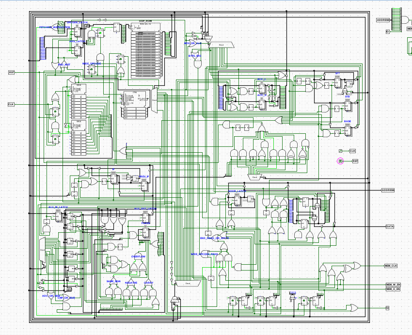
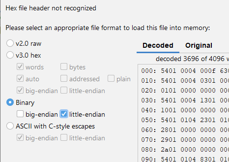

# smol cpu

### Description
This is a small cpu built in Logisim.

It has a 16 bit (memory/io) address space, 8 bit data bus and variable length opcodes (either 1 or 2 byte opcodes).

The ISA documentation is in the "isa.h" header.

Not all operations are currently implemented. Some are just not being emitted by the assembler, and some aren't even implemented in hardware. There's a bunch of TODOs in the isa.h, specifying what's missing. I may someday get around to putting them there, but this project was supposed to be a quick thing just to have some fun.

### Building/running programs
Just run make (the makefile assumes you have gcc installed, though). It'll generate two executables, asm.exe and isa.exe. The first is the assembler, and the second generates the uop rom.

To load the uop rom binary into the cpu, right click on the uop rom and select the "rom.bin" file. Load it as little endian.

To load a program, right click on the ram to load a memory image, and select the binary generated by the assembler. Nothing else needs to be done in this case, just click OK.

### Writing programs
To invoke the assembler, run:
	`asm.exe -i <input_file> -o <output_file>`

The syntax is very similar to Intel's x86 assembly:
	`instruction [destination], [source]`

Some instructions have two operands, some have one and some have none.

The cpu has 6 software visible registers:
	`accl` - Accumulator low byte. 8 bit general purpose register.
	`acch` - Accumulator high byte. 8 bit general purpose register.
	`accw` /`acc` - Accumulator. 16 bit general purpose register.
	`base` - 16 bit general purpose register. Has some special uses in the io instructions.
	`stt` - Stack top, 16 bit general purpose register. Works just like the x86 sp register. Decrements before pushing, increments after popping, so it points at the last thing pushed onto the stack.
	`stb` - Stack bottom, 16 bit register. Exists mostly to simplify accessing function arguments/local variables while stt changes. Can only be initialized by `stt`.

5 addressing modes are supported:
	- register to register (e.g. `mov accw, base`)
	- immediate (e.g. `mov accw, 0x1`)
	- indirect with immediate (e.g. `mov [some_label], stt`)
	- indirect with register (e.g. `mov [base], accl`)
	- indirect with register and immediate offset (e.g. `mov [stb - 4], base`)

#### Labels
It's possible to define labels, to be used either as jump targets, function calls or as variables. A label may start with a lower case, upper case or an underscore. The syntax is similar to the gnu assembler:
	`label_name:`

To reference a label, just use its name, without the collon:
	`jmp label_name`

A label name resolves to its offset inside the code. If a label is used to "name" a variable,
the indirect addressing mode must be used to access its value:
	`mov base, [label_name]`

#### Constants/string literals
The assembler accepts decimal, binary, hexadecimal and char constants.
Hexadecimal constants start with the `0x` prefix. Binary constants start with `0b`.
Char constants are similar to C/C++ char constants. They start and end with a `'`. Its value may be escaped by a \\. Those constants may be used as initializers or as immediate operands.

The assembler also accepts string literals. Those are similar to C/C++ as well. They start and end with a \".

#### Directives
It's possible to reserve storage for data by using either the `.byte`, `.word` or `.string`  directives. 

By themselves, the `.byte` and `.word` directives reserve a single item of their type.
	`.byte` - reserves storage for a single zero initialized byte.
	`.word` - reserves storage for a single zero initialized word.

Those directives accept an arbitrary number of initializers, and enough space is reserved for all of the values.
	`.byte 'b' 'a' 'l' 'l' 'z'` - reserves storage for 5 bytes, and initialize them to the provided values.
	`.word 0x0 0x1 0x2 0x3` - same deal as above, but for words.

It's also possible to pass a count parameter to those directives, which will make the assembler allocate the number of specified items.
	`.byte(0x10)` - allocates 16 zero initialized bytes.
	`.word (8)` - allocates 8 zero initialized words.

The count parameter and initializers are allowed at the same time. If the count parameter specifies more items than there are initializers for, the remaining items will be zero initialized. If the number of initializers is bigger than the count parameter, enough space is allocated to accomodate all initializers.

The following snippet allocates 0x100 bytes to be used as the stack:
	`mov stt, stack
	.byte(0x100)
	stack:`

The `.string` directive reserves storage for a null terminated string constant. 
	`.string "aaaaaAAAAAAAAHHHHHHH"`
	
It doesn't accept a count parameter, and always expects a string constant.

